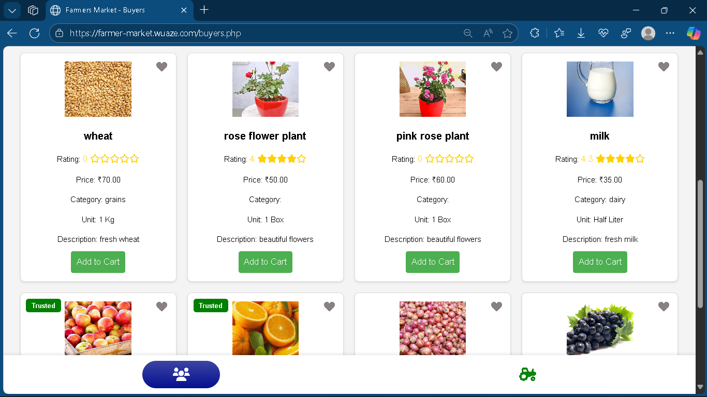

# 🌾 Online Market for Farmers

  
A **simple, secure** online marketplace connecting **farmers** and **buyers**, built with **PHP & MySQL**.

---

## 📌 Features
- 👨‍🌾 **Farmer Dashboard** – Add, edit, and manage products.
- 🛒 **Buyers** – Browse, search, and order products.
- 📦 **Order Management** – Track, accept, and ship orders.
- 🔐 **Role-Based Access** – Admin, Farmer, Buyer.
- 📧 **Email Notifications** for orders.
- 🔍 **Product Search** by category, price, and location.

## 🛠 Tech Stack
- **Backend:** PHP 
- **Database:** MySQL 
- **Frontend:** HTML5, CSS3, JavaScript  

## 🚀 Future Enhancements
- 📱 Mobile-friendly UI
- 🌍 Location-based product search
- 💳 Payment gateway integration
- 📊 Sales analytics for farmers

## 🚀 Live Demo
🔗 [Click here to view the project](https://farmer-market.wuaze.com/)
